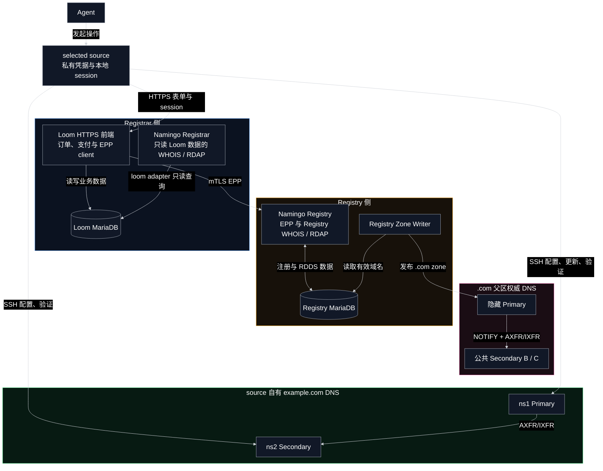
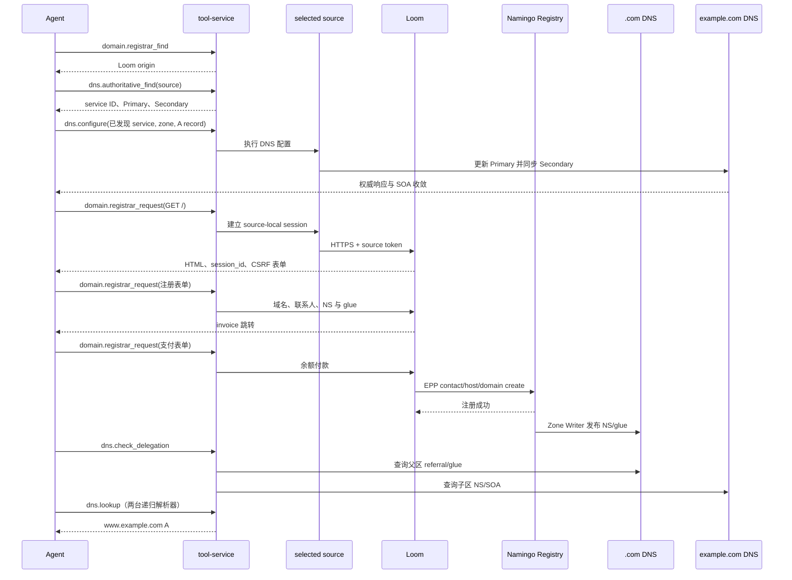

# source 自有 DNS 与域名注册设计

## 设计概览

B02a 展示 Agent 如何在 SeedEmu 网络内配置自有权威 DNS，并通过 Loom 和 Namingo 注册 `example.com`。总体架构由 Agent、Registrar、Registry，以及父区和子区 DNS 组成。

Loom 是购买流程的业务入口。它保存客户、订单和账单，在付款成功后通过 EPP 向 Namingo Registry 创建 contact、host 和 domain 对象。Namingo Registrar 使用 `loom` backend 读取同一份 Loom 数据，为注册结果提供 WHOIS 和 RDAP 查询。Registry 的 Zone Writer 再把有效委派发布到 `.com` 权威 DNS。

工具服务通过 Docker metadata 发现 source 所持有的权威 DNS；真正的 Registrar 请求、RDDS 查询和 DNS 配置则由 RuntimeBackend 在所选 source 内执行。Namingo Registrar 提供 Loom 业务视图，Namingo Registry 另行提供最终登记视图。

父区和子区分别管理不同的数据：`.com` 保存 `example.com` 的 NS 与 glue；source 自有 DNS 保存 `www.example.com` 等域内记录。两者通过正常 DNS 委派连接。

## Agent 工具调用流程

实际调用步骤如下：

1. Agent 调用 `domain.registrar_find`，从显式发布的 metadata 中发现 Loom origin。
2. Agent 使用所选 source 调用 `dns.authoritative_find`，发现分配给它的 service ID 以及 Primary/Secondary 地址。
3. Agent 将发现的 service ID 传给 `dns.configure`，创建 `example.com` 子区并写入 `www` 等记录；工具同时验证 Primary、Secondary 和 SOA。
4. Agent 调用 `domain.registrar_request` 请求 Loom 首页。工具从所选 source 建立认证 session，并返回页面、`session_id` 和 HTTP 证据。
5. Agent继续用同一 `session_id` 读取注册表单，保留 CSRF 字段，再提交域名、联系人、`ns1/ns2` 和 glue 地址。
6. Loom 创建订单和账单；Agent读取支付页面并提交余额付款。
7. Loom 的 EPP client 向 Namingo Registry 创建注册对象。Registry 成功提交后，Zone Writer 发布 `.com` 委派。
8. Agent 调用 `dns.check_delegation`，确认父区 NS/glue 与两台子区权威服务器一致。
9. Agent 调用 `dns.lookup`，分别通过 B02a 的两台递归解析器验证最终 A 记录。

Registrar session 和私有凭据保留在所选 source 内；Agent 通过工具看到的是可发现的 Loom 页面和结构化 DNS 结果。父区变更经 Registrar/Registry 完成，而购买后的普通子区记录继续使用 `dns.configure` 更新。

## Namingo Registrar 与 Loom

B02a 将 `NamingoRegistrarService` 配置为 `loom` backend。Namingo Registrar 通过专用只读账号连接 Loom MariaDB，因此 Registrar WHOIS/RDAP 与 Loom 订单展示的是同一份业务数据。Namingo Registry 另行提供直接读取 Registry MariaDB 的 WHOIS/RDAP 最终登记视图。Agent 使用 `domain.rdds_lookup` 的 `protocol` 和 `authority` 参数选择协议与视图。B02a 不启用 Namingo automation，订单驱动的域名生命周期由 Loom 负责。

## DNS 发布与解析

Namingo Registry 将注册数据交给 Zone Writer，Zone Writer 发布到 `.com` 隐藏 Primary，再通过 NOTIFY 和 TSIG 保护的 AXFR/IXFR 同步两台公共 Secondary。递归解析器从公共 Secondary 获得 `example.com` 的 referral 和 glue，随后查询 source 自有权威 DNS。

动态委派可能受到递归缓存影响，因此完整测试分别等待两台递归解析器收敛，而不是只验证其中一台，也不会通过清空缓存伪造成功。

## 实现与验证

主要实现位于：

- `seed-emulator/examples/internet/B02a_domain_registration/domain_registration.py`
- `seed-emulator/seedemu/services/LoomRegistrarService.py`
- `seed-emulator/seedemu/services/NamingoRegistrarService.py`
- `seed-emulator/seedemu/services/NamingoRegistryService.py`
- `seedemu-agent-tools/tool-service/seedemu_tool_service/tools/dns/`

Docker 购买测试覆盖 Loom session、下单付款、EPP 注册、WHOIS/RDAP、父区委派、子区权威响应，以及两台递归解析器的最终解析。
