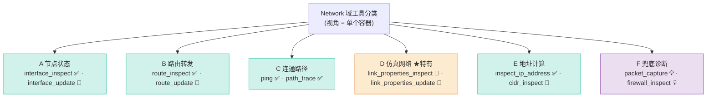
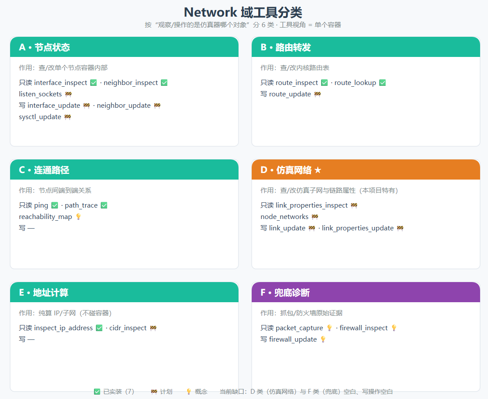

# Network 域分类（简要版）

> 一句话：Network 域按“观察/操作的是仿真器哪个对象”分 6 类，每类分只读（inspect）与写（update）；工具视角 = 单个容器。
> 详细版见 `learning/network-domain-classification-detailed.md`。

## 分类图

## 分类表

| 类 | 作用 | 只读例子 | 写例子 |
|---|---|---|---|
| **A 节点状态** | 查/改单个节点容器内部 | `interface_inspect` ✅ | `interface_update` 🚧 |
| **B 路由转发** | 查/改内核路由表 | `route_inspect` ✅ | `route_update` 🚧 |
| **C 连通路径** | 节点间通不通/走哪 | `ping` ✅ / `path_trace` ✅ | — |
| **D 仿真网络** ★特有 | 查/改仿真子网与链路属性 | `link_properties_inspect` 🚧 | `link_properties_update` 🚧 |
| **E 地址计算** | 纯算 IP/子网（不碰容器） | `inspect_ip_address` ✅ | — |
| **F 兜底诊断** | 抓包/防火墙原始证据 | `packet_capture` 💡 | `firewall_update` 💡 |

**状态**：✅ 已实装（7）｜ 🚧 计划｜ 💡 概念。**当前缺口**：D 类（仿真网络）与 F 类（兜底）空白、写操作空白。