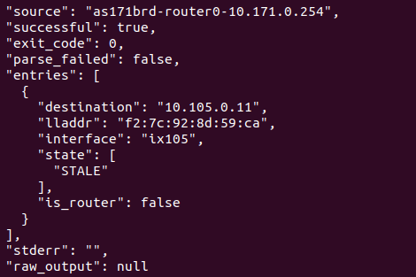

# network.neighbor_inspect 开发日志

> 说明：本文档是 `neighbor_inspect` 从"一条命令"到"一个工具"的**真实开发日志**。
> 配套抽象方法论：`learning/framework.md`；姊妹日志：`learning/route-inspect.md`、`learning/interface-inspect.md`

---

## 0. 工具概览（收尾后回填）

| 项 | 内容 |
|---|---|
| 工具名 | `network.neighbor_inspect` |
| 功能 | 查看节点内核邻居表（ARP + IPv6 ND）：每条邻居的 IP、MAC、所在接口、解析状态 |
| 模仿命令 | `ip -j neigh show`（iproute2，JSON 输出） |
| 类型 | 命令型 + JSON 结构化解析 |
| 涉及文件 | models/tools/registration + tests + README + 本日志 |

---

## 1. 开发日志条目

### 条目 1：需求定位（阶段 A-0）

- **做了什么**：确定开发"查看节点邻居表"工具；
- **为什么**：排障问完"我是谁"（interface）和"三层怎么走"（route）后，还要问"二层通不通"
  ——邻居表（ARP/ND）给出对端 IP→MAC 的映射与解析状态，是 L2 排障的核心证据；
- **决定**：封装 `ip -j neigh show`，与 `interface_inspect` 同为 iproute2 + JSON，零新增依赖；
- **产出**：一句话功能描述（命令型）。

### 条目 2：观察底层命令（阶段 A-1）

- **做了什么**：分析 `ip -j neigh show` 的 JSON 结构（黄金样本）；
- **观察到 5 个事实**：
  1. 顶层是 JSON **数组**，每个元素一条邻居；
  2. 字段：`dst`（对端 IP）/ `lladdr`（MAC）/ `dev`（接口）/ `state`（状态数组）/ `flags`（标志数组）；
  3. `lladdr` 在条目未解析时**缺失**（例如 FAILED / INCOMPLETE）；
  4. `state` 是数组（REACHABLE / STALE / FAILED / PERMANENT ...）；
  5. IPv6 邻居的 `flags` 含 `router` 标记；
- **为什么重要**：这 5 个事实决定模型字段（`lladdr` 用 None 表达未解析、`is_router` 语义推导）
  和解析策略（JSON + state/flags 数组兜底）；
- **真实观察**：`ip neigh` 是**按需填充的 ARP/ND 缓存**——只有主机与同网段邻居
  发生二层通信（ARP/ND 解析）后才会有条目。A01 的 `as151h-host0-10.151.0.71` 无任何
  L2 流量，`ip -j neigh show` 返回 `[]`；先 `ping` 同网段网关（10.151.0.254）触发
  ARP 后再查，才会出现 REACHABLE 条目。**空表是合法状态**，工具必须区分"空表"
  与"命令失败/解析失败"；
- **产出**：黄金样本 + 设计需求清单 + "空表合法"语义确认。

### 条目 3：定义契约（阶段 B-1）

- **做了什么**：`models.py` 写 `NeighborInspectArguments` / `NeighborEntry` / `NeighborInspectResult`；
- **关键决策**：
  - 入参 `source` + `include_raw_output`（对齐 interface_inspect 的诊断开关）；
  - `lladdr: str | None`：诚实表达"未解析"（P6）；
  - `is_router: bool`：由 flags 推导的语义字段（P2）；
  - `parse_failed` 显式表达 JSON 解析失败（与 interface_inspect 一致的全有或全无语义）；
  - `extra="forbid"` + `Field(description)`（P4）；
- **产出**：契约定稿。

### 条目 4：实现方法本体（阶段 A-2）

- **做了什么**：`tools.py` 写 `_parse_neighbor_json` + `neighbor_inspect`；
- **关键决策**：
  - 命令用参数向量 `["ip", "-j", "neigh", "show"]`（P1）；
  - 解析 gate 在 `exit_code == 0` 上；
  - `json.loads` 包 try/except（P6 容错）；
  - `state`/`flags` 做字符串→数组兜底（旧版 iproute2 可能给单值）；
  - `successful` / `parse_failed` 双状态字段（P2/P3）；
- **产出**：方法本体完成。

### 条目 5：注册（阶段 B-2）

- **做了什么**：`registration.py` 注册 `network.neighbor_inspect`；
- **产出**：`/api/v1/tools` 可见（network 域达到 5 个）。

### 条目 6：测试（阶段 B-3）

- **做了什么**：`test_network_tools.py` 新增 5 个用例（解析/命令失败/解析失败/入参校验/空表）；
- **黄金样本**：dict + `json.dumps` 构造，覆盖 REACHABLE（有 MAC）、PERMANENT、FAILED（无 MAC）+ router 标记；
- **空表用例**：VM 验证发现空闲主机邻居表为 `[]`，补 `test_neighbor_inspect_reports_empty_table`
  固化"空表 = 成功、entries 为空"的语义（与命令失败/解析失败区分）；
- **遇到的问题**：注册断言 4→7 个工具的索引顺移，需同步更新 `input_schema` 断言；
- **产出**：测试用例 + 断言更新。

### 条目 7：文档同步（阶段 B-4）

- **做了什么**：README 补 `neighbor_inspect` 条目 + `ip -j neigh show` JSON 解析说明；
- **产出**：文档与代码一致。

### 条目 8：虚拟机端到端验证——发现"空表是合法状态"

- **验证结果**：对 `as151h-host0-10.151.0.71` 执行 `ip -j neigh show` 返回 `[]`——
  该主机空闲、未与任何同网段邻居发生二层通信，邻居表（按需填充的 ARP/ND 缓存）为空；
- **确认工具语义正确**：`network.neighbor_inspect` 输出 `successful: true, parse_failed: false,
  entries: []`——空表与命令失败/解析失败被正确区分（P2/P3）；
- **填充方法**：先 `ping` 同网段网关/对端触发 ARP，再查即出现 REACHABLE 条目（见第 5 节）；
- **验证环境**：`examples/internet/B00_mini_internet`（多 AS + 路由器 + 每 AS 2 主机）。
- **已同步修复**：VM 验证 `interface_inspect` 时发现 `parse_failed` 反转 bug，`neighbor_inspect`
  存在同款 bug，已在 `tools.py` 一并修复（`parse_failed = not parse_ok`）；
- **回填条件**：若真实容器的邻居表输出与黄金样本有差异，按真实输出更新 fixture。

---

## 3. 最终交付物清单

| 文件 | 改动 |
|---|---|
| `tools/network/models.py` | 新增 NeighborInspectArguments / NeighborEntry / NeighborInspectResult |
| `tools/network/tools.py` | 新增 `_parse_neighbor_json` + `neighbor_inspect` |
| `tools/network/registration.py` | 注册 `network.neighbor_inspect` |
| `tests/test_network_tools.py` | 注册断言 4→7；新增 5 个用例（含空表）+ `GOLDEN_NEIGHBORS` |
| `tests/test_api.py` | count 11→14 |
| `tool-service/README.md` | network 域补条目 |
| `learning/neighbor-inspect.md` | 本日志 |

---

## 4. 附录：最终代码（关键部分）

### models.py 新增

```python
class NeighborInspectArguments(ToolArguments):
    """邻居表检查工具的入参模型。"""

    source: str = Field(description="Name or ID of the emulated source container")
    include_raw_output: bool = Field(
        default=False,
        description="Include the complete ip neigh show output for diagnostics",
    )


class NeighborEntry(BaseModel):
    """邻居表（ARP / IPv6 ND）中的一条条目。"""

    destination: str = Field(description="Neighbor IP address")
    lladdr: str | None = Field(
        default=None,
        description="Resolved MAC address, or null if unresolved",
    )
    interface: str | None = Field(
        default=None,
        description="Interface the neighbor was learned on",
    )
    state: list[str] = Field(default_factory=list)
    is_router: bool = False


class NeighborInspectResult(BaseModel):
    """查看节点邻居表的结果。"""

    source: str
    successful: bool
    exit_code: int
    parse_failed: bool = False
    entries: list[NeighborEntry] = Field(default_factory=list)
    stderr: str
    raw_output: str | None = None
```

### tools.py 新增

```python
@staticmethod
# 接收字符串 output，解析成 NeighborEntry 邻居条目列表
def _parse_neighbor_json(output: str) -> tuple[list[NeighborEntry], bool]:
    """把 ``ip -j neigh show`` 的 JSON 输出解析成结构化邻居条目列表。"""
    # 尝试把字符串转为 Python 对象（列表/字典）
    # 确保后续代码操作的 raw_entries 一定是一个列表
    try:
        raw_entries = json.loads(output)
    except json.JSONDecodeError:
        return [], False
    if not isinstance(raw_entries, list):
        return [], False

    entries: list[NeighborEntry] = []
    # 遍历列表所有的对象（邻居条目）
    for raw in raw_entries:
        # 若不是字典类型，则直接跳过
        if not isinstance(raw, dict):
            continue
        # state / flags 做字符串→数组兜底（旧版 iproute2 可能给单值）
        state = raw.get("state") or []
        if isinstance(state, str):
            state = [state]
        flags = raw.get("flags") or []
        if isinstance(flags, str):
            flags = [flags]
        # 组装一条邻居条目（lladdr 未解析时为 None）
        entries.append(
            NeighborEntry(
                destination=raw.get("dst", ""),
                lladdr=raw.get("lladdr"),
                interface=raw.get("dev"),
                state=state,
                is_router="router" in flags,
            )
        )
    return entries, True


# 方法签名
def neighbor_inspect(
    self,
    source: str,
    include_raw_output: bool = False,
) -> NeighborInspectResult:
    """查看仿真节点内核的邻居表（ARP / IPv6 ND）。"""
    # 拼命令并执行
    result = self._backend.execute(source, ["ip", "-j", "neigh", "show"])

    # 解析结果字段初始化
    entries: list[NeighborEntry] = []
    parse_failed = False
    # 命令失败时不解析 stdout（内容可能是报错文本）
    if result.exit_code == 0:
        # 解析器返回 (列表, parse_ok)，parse_failed 取其反
        entries, parse_ok = self._parse_neighbor_json(result.stdout)
        parse_failed = not parse_ok

    # 组装最终的结果，并返回
    return NeighborInspectResult(
        source=source,
        successful=result.exit_code == 0,
        exit_code=result.exit_code,
        parse_failed=parse_failed,
        entries=entries,
        stderr=result.stderr,
        raw_output=result.stdout if include_raw_output else None,
    )
```

### registration.py 新增

```python
registry.register(
    definition=ToolDefinition(
        name="network.neighbor_inspect",
        domain="network",
        description="Inspect the kernel neighbor table (ARP/ND) of an emulated node.",
    ),
    handler=tools.neighbor_inspect,
    arguments_model=NeighborInspectArguments,
)
```

---

## 5. 验证：在虚拟机里让 emulator 执行工具的底层命令

### 5.1 验证环境：B00_mini_internet

> 使用 `examples/internet/B00_mini_internet` 进行验证：5 个 transit AS + 12 个 stub AS +
> 每 AS 2 个主机，BGP/OSPF 全量运行——路由器天然有邻居，主机可互 ping 填充 ARP。

构建（VM 内）：

```bash
cd <seed-emulator>/examples/internet/B00_mini_internet
python mini_internet.py           # 生成 output/（默认每 AS 2 个主机）
cd output && docker compose up -d # 启动容器
```

> **踩坑记录（切换实验必看）**：从旧实验切到 B00 前，必须先 `docker compose down` 旧实验
> （在旧实验的 output 目录下）并清理残留网络，否则 Docker 报
> `invalid pool request: Pool overlaps with other one on this address space`——
> B00 要创建的网络（10.x.0.0/24）与旧实验的网络地址池重叠。
> 只加 `--remove-orphans` 不够（那只删孤儿容器、不删网络）；
> 残留网络用 `docker network prune` 一键清理。

### 5.2 空表是合法状态

```bash
docker exec as151h-host0-10.151.0.71 ip -j neigh show
# []   ← 空闲主机无二层通信，ARP/ND 缓存为空，属正常现象
```

### 5.3 在 B00 里看邻居（正确姿势，AS 编号以实际为准）

> B00 的 stub AS 编号为 150-154 / 160-164 / 170-171，不同版本/示例可能不同；
> 容器命名有规律：stub 路由器 `as<ASN>brd-router0-10.<ASN>.0.254`、
> 主机 `as<ASN>h-host_0-10.<ASN>.0.71`（旧版无下划线：`host0`）。
> **先 `docker ps` 看实际容器，用下面任意一个存在的 AS 即可。**

```bash
docker ps | grep -E "as[0-9]+"     # 看实际有哪些 AS 的容器在跑

# ① 路由器：BGP/OSPF 使 ARP 缓存天然有内容（任选一个路由器容器）
docker ps | grep brd-router0          # stub AS 路由器（如 as150brd-router0-10.150.0.254）
docker ps | grep -E "as[0-9]+r-r"     # transit AS 路由器（如 as2r-r1-10.2.0.1）
docker exec <任一路由器容器名> ip -j neigh show
# 应有多条 REACHABLE 条目（对端是各直连网段的邻居）

# ② 主机：先 ping 同网段对端，触发 ARP 再看（同一 stub AS 的两个主机同网段）
docker ps | grep "h-host"            # 如 as150h-host_0-10.150.0.71 / as150h-host_1-10.150.0.72
docker exec as150h-host_0-10.150.0.71 ping -c 1 10.150.0.72
docker exec as150h-host_0-10.150.0.71 ip -j neigh show
# [{"dst":"10.150.0.72","lladdr":"02:42:...","dev":"net0",
#   "state":["REACHABLE"],"flags":[]}]   （MAC 以实际为准）
```

### 5.4 端到端

```bash
cd <agent-tools>/tool-service
source .venv/bin/activate
python3.11 - <<EOF
from seedemu_tool_service.backends import DockerRuntimeBackend
from seedemu_tool_service.tools.network.tools import NetworkTools

tools = NetworkTools(DockerRuntimeBackend())
# 容器名替换为你 docker ps 里实际存在的（任一主机或路由器）
result = tools.neighbor_inspect("as171brd-router0-10.171.0.254")
print(result.model_dump_json(indent=2))
EOF
```

> 对照要点：空闲主机应输出 `entries: []`（successful=true, parse_failed=false）；
> 路由器容器应有多条 REACHABLE 条目；主机 ping 对端后再查应出现 REACHABLE 条目；
> `lladdr` 缺失的条目应输出 `null`；IPv6 邻居的 `is_router` 应为 true。

### 5.5 对照原始命令
原命令:
```
docker exec  as171brd-router0-10.171.0.254 ip -j neigh show
[{"dst":"10.105.0.11",
"dev":"ix105",
"lladdr":"f2:7c:92:8d:59:ca",
"state":["REACHABLE"]}]
```
tools命令：
```
{
  "source": "as171brd-router0-10.171.0.254",
  "successful": true,
  "exit_code": 0,
  "parse_failed": false,
  "entries": [
    {
      "destination": "10.105.0.11",
      "lladdr": "f2:7c:92:8d:59:ca",
      "interface": "ix105",
      "state": [
        "STALE"
      ],
      "is_router": false
    }
  ],
  "stderr": "",
  "raw_output": null
}

```
