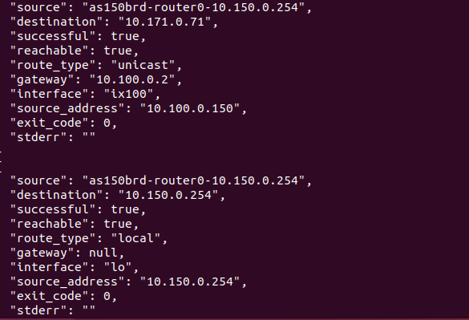

# network.route_lookup 开发日志

> 说明：本文档是 `route_lookup` 从"一条命令"到"一个工具"的**真实开发日志**。
> 配套抽象方法论：`learning/framework.md`；姊妹日志：`learning/route-inspect.md`

---

## 0. 工具概览（收尾后回填）

| 项 | 内容 |
|---|---|
| 工具名 | `network.route_lookup` |
| 功能 | 查询内核"到某个具体目标实际走哪条路由"（含策略路由规则） |
| 模仿命令 | `ip route get <dest>` |
| 类型 | 命令型 + 文本关键字扫描（复用 route_inspect 的 via/dev/src 思路） |
| 涉及文件 | models/tools/registration + tests + README + 本日志 |

---

## 1. 开发日志条目

### 条目 1：需求定位（阶段 A-0）

- **做了什么**：确定开发"逐目标查路由"工具；
- **为什么**：`route_inspect` 回答"有哪些路由"，但不回答"到 X 走哪条"——后者要考虑最长前缀
  匹配和策略路由规则（`ip rule`），这是排障"流量走错路"的关键信息；
- **决定**：封装 `ip route get`，它让内核做真实选路；
- **产出**：一句话功能描述（命令型）。

### 条目 2：观察底层命令（阶段 A-1）

- **做了什么**：分析 `ip route get` 的三种典型输出（黄金样本）；
- **观察到 4 个事实**：
  1. 首行首 token 是**路由类型**：普通转发时是目标 IP，否则是 `unreachable`/`local`/`blackhole` 等关键字；
  2. 普通行含 `via`（下一跳）/`dev`（接口）/`src`（源地址）关键字——与 `ip route show` 同构；
  3. 文本模式第二行是 `cache`（噪音，忽略）；
  4. `unreachable` 时**退出码非零**（典型 2）——但输出位置因 iproute2 版本而异：
     有的版本把 `unreachable <ip>` 写到 stdout 首行，有的版本（B00 实测）stdout 为空、
     把 `RTNETLINK answers: Network is unreachable` 写到 stderr——不能当普通命令失败；
- **为什么重要**：事实 4 直接推翻了"退出码非零就跳过解析"的惯例——`route_lookup` 必须
  无论退出码都解析 stdout 首行，**并做 stderr 兜底**识别 unreachable；
- **产出**：黄金样本 + 设计需求清单。

### 条目 3：定义契约（阶段 B-1）

- **做了什么**：`models.py` 写 `RouteLookupArguments` / `RouteLookupResult`；
- **关键决策**：
  - `destination` 用 `ip_address` 强校验（P4）——`ip route get` 不做 DNS，必须给 IP；
  - 结果拆两层语义：`successful`（退出码）与 `reachable`（路由类型属于 unicast/local/broadcast/multicast）；
  - `route_type` 显式保留路由类型，`gateway`/`interface`/`source_address` 用 None 表达缺失（P6）；
- **产出**：契约定稿。

### 条目 4：实现方法本体（阶段 A-2）

- **做了什么**：`tools.py` 写 `_parse_route_get_line` + `route_lookup`；
- **关键决策**：
  - `_parse_route_get_line` 复用 route_inspect 的 via/dev/src 关键字扫描思路（P5），
    额外处理"首 token 是路由类型关键字"的分支；
  - 模块级常量 `_ROUTE_GET_TYPE_KEYWORDS` / `_REACHABLE_ROUTE_TYPES` 集中管理类型语义；
  - **解析不 gate 在退出码上**：无论成败都取 stdout 首非空行解析（unreachable 也是合法答案）；
  - **stderr 兜底**：若 stdout 无内容且退出码非零，stderr 含 `unreachable` 则 route_type 记为
    `unreachable`（B00 实测的 iproute2 版本把不可达错误写到 stderr）；
  - `reachable = route_type in _REACHABLE_ROUTE_TYPES`；
- **产出**：方法本体完成。

### 条目 5：注册（阶段 B-2）

- **做了什么**：`registration.py` 注册 `network.route_lookup`；
- **产出**：`/api/v1/tools` 可见（network 域达到 7 个）。

### 条目 6：测试（阶段 B-3）

- **做了什么**：`test_network_tools.py` 新增 6 个用例；
- **覆盖**：unicast（有网关/接口/源）、unreachable（stdout 版 + **stderr 版**）、local、
  入参 IP 校验（拒绝 hostname）、命令失败；FakeRuntimeBackend 补 `stderr` 参数；
- **遇到的问题**：注册断言 4→7 索引顺移；本地无 pytest 环境 → py_compile + 独立脚本模拟解析逻辑；
- **产出**：测试用例 + 断言更新。

### 条目 7：文档同步（阶段 B-4）

- **做了什么**：README 补 `route_lookup` 条目 + `ip route get` 说明；
- **产出**：文档与代码一致。

### 条目 8：虚拟机端到端验证——发现 unreachable 错误在 stderr

- **实测发现（B00）**：`ip route get 192.0.2.1` 在本 iproute2 版本中 **stdout 为空**、
  `RTNETLINK answers: Network is unreachable` 写到 stderr，退出码 2；
  unicast（`10.171.0.71`）与 local（本机地址）两个样本解析正确；
- **暴露的问题**：原实现只解析 stdout → unreachable 时 `route_type` 落空为 `null`，
  Agent 无法区分"显式不可达"与"无输出"；
- **修复**：route_lookup 增加 stderr 兜底——stdout 无内容且退出码非零时，
  stderr 含 `unreachable` 则 `route_type = "unreachable"`；新增 stderr 版测试用例；
- **验证环境**：`examples/internet/B00_mini_internet`（BGP 全互联，路由类型丰富），
  容器名以 `docker ps` 实际为准；
- **对照环节**：按第 5.4 节回填"原命令 vs tools 命令"的真实输出。

---

## 3. 最终交付物清单

| 文件 | 改动 |
|---|---|
| `tools/network/models.py` | 新增 RouteLookupArguments（含 destination 校验）/ RouteLookupResult |
| `tools/network/tools.py` | 新增路由类型常量 + `_parse_route_get_line` + `route_lookup` |
| `tools/network/registration.py` | 注册 `network.route_lookup` |
| `tests/test_network_tools.py` | 新增 5 个用例 |
| `tests/test_api.py` | count 11→14 |
| `tool-service/README.md` | network 域补条目 |
| `learning/route-lookup.md` | 本日志 |

---

## 4. 附录：最终代码（关键部分）

### models.py 新增

```python
class RouteLookupArguments(ToolArguments):
    """路由查找工具的入参模型。"""

    source: str = Field(description="Name or ID of the emulated source container")
    destination: str = Field(description="Destination IPv4 or IPv6 address to look up")

    @field_validator("destination")
    @classmethod
    def validate_destination(cls, value: str) -> str:
        """拒绝非 IP 输入，并归一化合法的 IPv4/IPv6 地址。"""
        return str(ip_address(value))


class RouteLookupResult(BaseModel):
    """针对单个目的地查询内核选路的结果。"""

    source: str
    destination: str
    successful: bool
    reachable: bool = False
    route_type: str | None = Field(
        default=None,
        description="unicast/unreachable/local/blackhole/...",
    )
    gateway: str | None = Field(default=None, description="Next-hop gateway address")
    interface: str | None = Field(default=None, description="Egress interface")
    source_address: str | None = Field(
        default=None,
        description="Preferred source address",
    )
    exit_code: int
    stderr: str
```

### tools.py 新增

```python
# ip route get 的首 token 可能是这些路由类型关键字
_ROUTE_GET_TYPE_KEYWORDS = {
    "unreachable", "local", "blackhole", "prohibit", "throw",
    "broadcast", "multicast", "nat", "anycast",
}
# 属于这些类型时，目的地可视为可达
_REACHABLE_ROUTE_TYPES = {"unicast", "local", "broadcast", "multicast"}


@staticmethod
# 接收一行字符串，解析出 (route_type, gateway, interface, source)
def _parse_route_get_line(
    line: str,
) -> tuple[str | None, str | None, str | None, str | None]:
    """把 ``ip route get`` 输出的第一行解析成 (route_type, gateway, interface, source)。"""
    # 按空白拆分成 token 列表，空行返回全 None
    fields = line.split()
    if not fields:
        return None, None, None, None

    # 首 token 是路由类型关键字（unreachable/local/...）则取其后的 token 为目的地
    if fields[0] in _ROUTE_GET_TYPE_KEYWORDS:
        route_type = fields[0]
        start = 2
    else:
        # 否则首 token 就是目的地，路由类型为 unicast
        route_type = "unicast"
        start = 1

    # 关键字扫描提取 via/dev/src
    gateway: str | None = None
    interface: str | None = None
    source: str | None = None
    index = start
    while index < len(fields):
        token = fields[index]
        if token in {"via", "dev", "src"} and index + 1 < len(fields):
            value = fields[index + 1]
            if token == "via":
                gateway = value
            elif token == "dev":
                interface = value
            else:
                source = value
            index += 2
        else:
            index += 1

    return route_type, gateway, interface, source


# 方法签名
def route_lookup(self, source: str, destination: str) -> RouteLookupResult:
    """查询内核"到某个目标实际走哪条路由"（含策略路由规则）。"""
    # 拼命令并执行
    result = self._backend.execute(source, ["ip", "route", "get", destination])

    # 解析结果字段初始化
    route_type: str | None = None
    gateway: str | None = None
    interface: str | None = None
    source_address: str | None = None
    # 无论退出码如何都要解析 stdout 第一行（unreachable 也是合法答案）
    for line in result.stdout.splitlines():
        if not line.strip():
            continue
        # 调用解析器提取 (route_type, gateway, interface, source)
        route_type, gateway, interface, source_address = self._parse_route_get_line(line)
        break

    # 兜底：部分 iproute2 版本把不可达错误写到 stderr（stdout 为空），从 stderr 识别
    if route_type is None and result.exit_code != 0 and "unreachable" in result.stderr.lower():
        route_type = "unreachable"

    # 组装最终的结果，并返回
    return RouteLookupResult(
        source=source,
        destination=destination,
        successful=result.exit_code == 0,
        reachable=route_type in _REACHABLE_ROUTE_TYPES,
        route_type=route_type,
        gateway=gateway,
        interface=interface,
        source_address=source_address,
        exit_code=result.exit_code,
        stderr=result.stderr,
    )
```

### registration.py 新增

```python
registry.register(
    definition=ToolDefinition(
        name="network.route_lookup",
        domain="network",
        description="Query how the kernel routes traffic to a specific destination.",
    ),
    handler=tools.route_lookup,
    arguments_model=RouteLookupArguments,
)
```

---

## 5. 验证：在虚拟机里让 emulator 执行工具的底层命令

### 5.1 验证环境：B00_mini_internet

> 使用 `examples/internet/B00_mini_internet` 进行验证：BGP 全互联，每个节点都有丰富的
> 路由表（多条直连 + default + BGP 学习路由），可测 unicast / local / unreachable 三种选路。

构建（VM 内）：

```bash
cd <seed-emulator>/examples/internet/B00_mini_internet
python mini_internet.py           # 生成 output/（默认每 AS 2 个主机）
cd output && docker compose up -d # 启动容器
```

> **踩坑记录（切换实验必看）**：从旧实验切到 B00 前，必须先 `docker compose down` 旧实验
> （在旧实验的 output 目录下）并清理残留网络，否则 Docker 报
> `invalid pool request: Pool overlaps with other one on this address space`——
> B00 要创建的网络（10.x.0.0/24）与旧实验的网络地址池重叠。
> 只加 `--remove-orphans` 不够（那只删孤儿容器、不删网络）；
> 残留网络用 `docker network prune` 一键清理。

### 5.2 在 B00 里跑 route get（三个典型样本，AS 编号以实际为准）

> B00 里 BGP 全互联，绝大多数地址都可达；unreachable 要选**未宣告的测试网段**
> （如 192.0.2.0/24 这类 TEST-NET 地址）。容器名以 `docker ps` 实际为准。

```bash
docker ps | grep -E "as[0-9]+"     # 看实际有哪些 AS 的容器在跑

# ① unicast：查远端 AS 的地址（走 default/via 网关）
docker exec as150brd-router0-10.150.0.254 ip route get 10.171.0.71
# 10.171.0.71 via <网关> dev ix100 src 10.150.0.254 uid 0

# ② local：查本机自身地址
docker exec as150brd-router0-10.150.0.254 ip route get 10.150.0.254
# local 10.150.0.254 dev lo src 10.150.0.254 uid 0

# ③ unreachable：查未宣告的测试网段（观察退出码与 stderr）
docker exec as150brd-router0-10.150.0.254 ip route get 192.0.2.1; echo $?
# RTNETLINK answers: Network is unreachable   ← B00 的 iproute2 把错误写到 stderr，stdout 为空
# 2   ← 退出码非零；工具必须做 stderr 兜底识别 unreachable
```

### 5.3 端到端

```bash
cd <agent-tools>/tool-service
source .venv/bin/activate
python3.11 - <<EOF
from seedemu_tool_service.backends import DockerRuntimeBackend
from seedemu_tool_service.tools.network.tools import NetworkTools

tools = NetworkTools(DockerRuntimeBackend())
# 容器名替换为你 docker ps 里实际存在的；三个典型样本：unicast / local / unreachable
for dest in ["10.171.0.71", "10.150.0.254", "192.0.2.1"]:
    result = tools.route_lookup("as150brd-router0-10.150.0.254", dest)
    print(result.model_dump_json(indent=2))
EOF
```

> 对照要点：unicast 的 route_type 应为 unicast、reachable 为 true；
> local 的 route_type 为 local、reachable 为 true；
> unreachable 的 reachable 为 false 且 route_type 为 unreachable（exit_code 非零但 successful=false）。

### 5.4 对照原始命令

原命令：

```bash
远端AS：
docker exec as150brd-router0-10.150.0.254 ip route get 10.171.0.71
10.171.0.71 via 10.100.0.2 dev ix100 src 10.100.0.150 uid 0 
    cache 

本地回环：
docker exec as150brd-router0-10.150.0.254 ip route get 10.150.0.254
local 10.150.0.254 dev lo src 10.150.0.254 uid 0 

未宣告测试：
docker exec as150brd-router0-10.150.0.254 ip route get 192.0.2.1; echo $?
RTNETLINK answers: Network is unreachable
2

```

tools 命令输出：

```json
{
  "source": "as150brd-router0-10.150.0.254",
  "destination": "10.171.0.71",
  "successful": true,
  "reachable": true,
  "route_type": "unicast",
  "gateway": "10.100.0.2",
  "interface": "ix100",
  "source_address": "10.100.0.150",
  "exit_code": 0,
  "stderr": ""
}
{
  "source": "as150brd-router0-10.150.0.254",
  "destination": "10.150.0.254",
  "successful": true,
  "reachable": true,
  "route_type": "local",
  "gateway": null,
  "interface": "lo",
  "source_address": "10.150.0.254",
  "exit_code": 0,
  "stderr": ""
}
{
  "source": "as150brd-router0-10.150.0.254",
  "destination": "192.0.2.1",
  "successful": false,
  "reachable": false,
  "route_type": "unreachable",
  "gateway": null,
  "interface": null,
  "source_address": null,
  "exit_code": 2,
  "stderr": "RTNETLINK answers: Network is unreachable\n"

}
```
