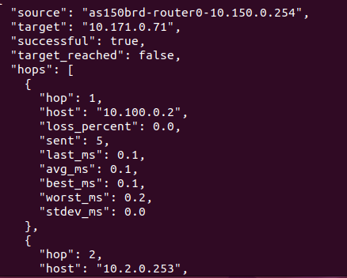

# network.path_trace 开发日志

> 说明：本文档是 `path_trace` 从"一条命令"到"一个工具"的**真实开发日志**。
> 配套抽象方法论：`learning/framework.md`；姊妹日志：`learning/route-inspect.md`

---

## 0. 工具概览（收尾后回填）

| 项 | 内容 |
|---|---|
| 工具名 | `network.path_trace` |
| 功能 | 用 mtr report 模式追踪到目标的逐跳路径，含每跳丢包率与 RTT 统计 |
| 模仿命令 | `mtr --report -c N --no-dns <target>`（`-c` 等价 `--report-cycles`） |
| 类型 | 命令型 + 固定列解析 |
| 涉及文件 | models/tools/registration + tests + README + 本日志 |

---

## 1. 开发日志条目

### 条目 1：需求定位（阶段 A-0）

- **做了什么**：确定开发"路径追踪 + 每跳质量"工具；
- **为什么**：`ping` 只给"终点通不通"，`path_trace` 给出"经过哪些跳、每一跳丢不丢包、延迟多少"——
  是定位"路径上哪一跳出问题"的核心工具；
- **决定**：封装 `mtr`（mtr-tiny）而非 `traceroute`——seedemu-base 镜像只装了 `mtr`，
  且 mtr 的 report 模式（`-r`）天生输出固定列，比 `traceroute` 更适合程序解析；
- **产出**：一句话功能描述（命令型）。

### 条目 2：观察底层命令（阶段 A-1）

- **做了什么**：分析 `mtr --report` 输出结构（黄金样本）；
- **观察到 4 个事实**：
  1. 输出分 `Start:`（时间戳）、`HOST:`（列头）、数据行三部分；
  2. 数据行以 ``|--`` 标记，字段顺序固定：跳号 |-- 对端 Loss% Snt Last Avg Best Wrst StDev；
  3. 无响应的跳对端显示为 `???`，Loss% 为 100%；
  4. `--no-dns` 关闭反向解析后，对端只可能是 IP 或 `???`（列宽稳定）；
- **为什么重要**：固定列意味着可用位置解析（P5 的例外——顺序稳定）；
- **风险点（已落地）**：`mtr-tiny` 的选项支持需在真容器实测——实测发现该版本**不认 `--count`**，
  正确写法是 `-c`（等价 `--report-cycles`）；`--report`/`--no-dns` 均支持。
  这是 M1 里唯一"命令能力不确定"的工具，A-1 观察必须优先；
- **产出**：黄金样本 + 设计需求清单。

### 条目 3：定义契约（阶段 B-1）

- **做了什么**：`models.py` 写 `PathTraceArguments` / `TraceHop` / `PathTraceResult`；
- **关键决策**：
  - 入参 `target`（IP 或 hostname，min_length=1）+ `count`（ge=1 le=20，控制探测数）；
  - `TraceHop.host: str | None`：`???` 映射为 None（P6）；
  - 数值字段（loss/延迟）都 `float | None`，解析失败用 None；
  - `target_reached` 语义字段：最后一跳有响应（host 非 None）；
  - `raw_output` 常驻（对齐 DNS trace 的 precedent）——mtr report 本身就是关键证据；
- **产出**：契约定稿。

### 条目 4：实现方法本体（阶段 A-2）

- **做了什么**：`tools.py` 写 `_parse_trace_report` + `path_trace`，加模块级 `_as_float`/`_as_int` 兜底；
- **关键决策**：
  - 命令用参数向量 `["mtr", "--report", "-c", str(count), "--no-dns", target]`（P1；
    探测数用 `-c`——VM 实测发现该版本 mtr 不认 `--count`）；
  - 解析：只处理含 ``|--`` 的行；`fields[0]` 剥 ``.`` 前缀取跳号；`fields[1]` 为对端；
  - 数值解析用 `_as_float`/`_as_int` 容错（P6）；
  - **`target_reached` 不能看退出码**：mtr 目标不可达也常以退出码 0 结束，
    必须从数据推导（最后一跳 host 非 None）；
- **产出**：方法本体完成。

### 条目 5：注册（阶段 B-2）

- **做了什么**：`registration.py` 注册 `network.path_trace`；
- **产出**：`/api/v1/tools` 可见。

### 条目 6：测试（阶段 B-3）

- **做了什么**：`test_network_tools.py` 新增 4 个用例（解析/未达目标/count 校验/命令失败）；
- **黄金样本**：手工构造两段 mtr report（一段可达、一段末跳 `???`）；
- **遇到的问题**：report 文本含 `\n`，在测试字符串里要正确转义；本地无 pytest → py_compile + 独立模拟；
- **flag 修正**：VM 实测发现 `--count` 不被 mtr 支持，tools.py 命令向量与测试断言同步改为 `-c`；
- **产出**：测试用例 + 断言更新。

### 条目 7：文档同步（阶段 B-4）

- **做了什么**：README 补 `path_trace` 条目 + `mtr` 前置说明；
- **产出**：文档与代码一致。

### 条目 8：虚拟机端到端验证——发现 mtr 不认 `--count`

- **实测发现**：在 B00 容器执行 `mtr --report --count 5 --no-dns <target>` 报
  `unrecognized option '--count'`——该 mtr 版本用 `-c, --report-cycles` 指定探测数；
- **修复**：命令向量改为 `["mtr", "--report", "-c", str(count), "--no-dns", target]`，
  同步更新测试断言与本文档所有命令示例；
- **验证环境**：`examples/internet/B00_mini_internet`（跨 AS 多跳路径，path_trace 的理想测试场），
  容器名/目标 IP 以 `docker ps` 实际为准；
- **回填条件**：确认 mtr report 输出格式与黄金样本一致（列宽、`|--`、`???`）；如有差异更新 fixture；
- **对照环节**：按第 5.4 节回填"原命令 vs tools 命令"的真实输出。

---

## 3. 最终交付物清单

| 文件 | 改动 |
|---|---|
| `tools/network/models.py` | 新增 PathTraceArguments / TraceHop / PathTraceResult |
| `tools/network/tools.py` | 新增 `_as_float`/`_as_int` + `_parse_trace_report` + `path_trace` |
| `tools/network/registration.py` | 注册 `network.path_trace` |
| `tests/test_network_tools.py` | 新增 4 个用例 + `GOLDEN_TRACE_REPORT` |
| `tests/test_api.py` | count 11→14 |
| `tool-service/README.md` | network 域补条目 |
| `learning/path-trace.md` | 本日志 |

---

## 4. 附录：最终代码（关键部分）

### models.py 新增

```python
class PathTraceArguments(ToolArguments):
    """路径追踪工具的入参模型。"""

    source: str = Field(description="Name or ID of the emulated source container")
    target: str = Field(min_length=1, description="Destination IP address or hostname")
    count: int = Field(
        default=5,
        ge=1,
        le=20,
        description="Number of probes sent to each hop",
    )


class TraceHop(BaseModel):
    """路径中一跳的逐跳统计。"""

    hop: int
    host: str | None = Field(
        default=None,
        description="Hop IP address, or null for a non-responding hop",
    )
    loss_percent: float | None = None
    sent: int | None = None
    last_ms: float | None = None
    avg_ms: float | None = None
    best_ms: float | None = None
    worst_ms: float | None = None
    stdev_ms: float | None = None


class PathTraceResult(BaseModel):
    """路径追踪的结果。"""

    source: str
    target: str
    successful: bool
    target_reached: bool = False
    hops: list[TraceHop] = Field(default_factory=list)
    exit_code: int
    stderr: str
    raw_output: str = ""
```

### tools.py 新增

```python
def _as_float(token: str) -> float | None:
    """把 mtr report 的数值 token 转成 float，失败返回 None。"""
    try:
        return float(token)
    except ValueError:
        return None


def _as_int(token: str) -> int | None:
    """把 mtr report 的整数 token 转成 int，失败返回 None。"""
    try:
        return int(token)
    except ValueError:
        return None


@staticmethod
# 接收 mtr report 输出，解析成逐跳统计列表
def _parse_trace_report(output: str) -> list[TraceHop]:
    """把 ``mtr --report`` 输出解析成逐跳统计列表。"""
    hops: list[TraceHop] = []
    # 数据行以 |-- 标记，跳过 Start:/HOST: 等行
    for line in output.splitlines():
        if "|--" not in line:
            continue
        # 按空白切分，字段顺序固定：跳号 |-- 对端 Loss% Snt Last Avg Best Wrst StDev
        fields = line.split()
        if len(fields) < 8:
            continue
        # 提取跳号（剥掉 "N.|--" 中的前缀）
        try:
            hop = int(fields[0].split(".")[0])
        except ValueError:
            continue
        # 对端为 ??? 表示无响应，映射为 None
        host_token = fields[1]
        hops.append(
            TraceHop(
                hop=hop,
                host=None if host_token == "???" else host_token,
                loss_percent=_as_float(fields[2].rstrip("%")),
                sent=_as_int(fields[3]),
                last_ms=_as_float(fields[4]),
                avg_ms=_as_float(fields[5]),
                best_ms=_as_float(fields[6]),
                worst_ms=_as_float(fields[7]),
                stdev_ms=_as_float(fields[8]) if len(fields) > 8 else None,
            )
        )
    return hops


# 方法签名
def path_trace(
    self,
    source: str,
    target: str,
    count: int = 5,
) -> PathTraceResult:
    """用 mtr report 模式追踪到目标的逐跳路径与每跳质量。"""
    # 拼命令并执行（-c 指定每跳探测数，--no-dns 关闭反向解析）
    result = self._backend.execute(
        source,
        ["mtr", "--report", "-c", str(count), "--no-dns", target],
    )

    # 解析 mtr report 为逐跳统计列表
    hops = self._parse_trace_report(result.stdout)
    # mtr 目标不可达也常以退出码 0 结束，因此从数据推导 target_reached
    target_reached = bool(hops) and hops[-1].host is not None

    # 组装最终的结果，并返回（raw_output 保留完整 report 作为诊断证据）
    return PathTraceResult(
        source=source,
        target=target,
        successful=result.exit_code == 0,
        target_reached=target_reached,
        hops=hops,
        exit_code=result.exit_code,
        stderr=result.stderr,
        raw_output=result.stdout,
    )
```

### registration.py 新增

```python
registry.register(
    definition=ToolDefinition(
        name="network.path_trace",
        domain="network",
        description="Trace the route to a target with per-hop loss and latency statistics.",
    ),
    handler=tools.path_trace,
    arguments_model=PathTraceArguments,
)
```

---

## 5. 验证：在虚拟机里让 emulator 执行工具的底层命令

### 5.1 验证环境：B00_mini_internet

> 使用 `examples/internet/B00_mini_internet` 进行验证：5 个 transit AS + 12 个 stub AS，
> 跨 AS 路径通常 3-5 跳（stub → ix → transit → ix → stub），适合测试多跳路径。

构建（VM 内）：

```bash
cd <seed-emulator>/examples/internet/B00_mini_internet
python mini_internet.py           # 生成 output/（默认每 AS 2 个主机）
cd output && docker compose up -d # 启动容器
```

> **踩坑记录（切换实验必看）**：从旧实验切到 B00 前，必须先 `docker compose down` 旧实验
> （在旧实验的 output 目录下）并清理残留网络，否则 Docker 报
> `invalid pool request: Pool overlaps with other one on this address space`——
> B00 要创建的网络（10.x.0.0/24）与旧实验的网络地址池重叠。
> 只加 `--remove-orphans` 不够（那只删孤儿容器、不删网络）；
> 残留网络用 `docker network prune` 一键清理。

### 5.2 在 B00 里跑 mtr（正确姿势，AS 编号以实际为准）

> B00 的 stub AS 编号为 150-154 / 160-164 / 170-171，不同版本可能不同；
> 容器名以 `docker ps` 实际为准。路径追踪要选**跨多个 AS** 的目标：
> 从任意 stub AS 的路由器追踪到**另一个 AS** 的地址。

```bash
docker ps | grep -E "as[0-9]+"     # 看实际有哪些 AS 的容器在跑

# ① 先确认 mtr-tiny 的 report 能力（本次最高优先级）
docker exec <任一路由器容器> mtr --report -c 3 --no-dns 10.171.0.71
# 应输出 Start:/HOST:/数据行，格式与黄金样本一致

# ② 跨 AS 追踪：从 as150 的 stub 路由器追踪到 as171 的主机（路径经 ix100 → transit → ix105）
docker exec as150brd-router0-10.150.0.254 mtr --report -c 5 --no-dns 10.171.0.71
# 应看到 3-5 跳：10.150.0.1 → transit 路由器（10.x.x.x）→ ... → 10.171.0.71
```

### 5.3 端到端

```bash
cd <agent-tools>/tool-service
source .venv/bin/activate
python3.11 - <<EOF
from seedemu_tool_service.backends import DockerRuntimeBackend
from seedemu_tool_service.tools.network.tools import NetworkTools

tools = NetworkTools(DockerRuntimeBackend())
# 容器名与目标 IP 替换为你 docker ps 里实际存在的（跨 AS 追踪）
result = tools.path_trace("as150brd-router0-10.150.0.254", "10.171.0.71", count=5)
print(result.model_dump_json(indent=2))
EOF
```

> 对照要点：数据行 ``|--`` 标记、跳号前缀、`???` 表示、列对齐是否与黄金样本一致；
> `???` 跳的 host 应为 null；`target_reached` 由最后一跳推导；
> 如有差异，按第 1 节条目 8 更新解析器与测试 fixture。

### 5.4 对照原始命令（验证后回填）

原命令：

```bash
docker exec as150brd-router0-10.150.0.254 mtr --report -c 5 --no-dns 10.171.0.71
Start: 2026-08-25T09:55:00+0000
HOST: c9e0a9668a72                Loss%   Snt   Last   Avg  Best  Wrst StDev
  1.|-- 10.100.0.2                 0.0%     5    0.2   0.2   0.1   0.2   0.0
  2.|-- 10.2.0.253                 0.0%     5    0.3   0.2   0.2   0.3   0.1
  3.|-- 10.2.1.253                 0.0%     5    0.3   0.4   0.2   0.7   0.2
  4.|-- ???                       100.0     5    0.0   0.0   0.0   0.0   0.0

```

tools 命令输出（验证后回填）：

```json
{
  {
  "source": "as150brd-router0-10.150.0.254",
  "target": "10.171.0.71",
  "successful": true,
  "target_reached": false,
  "hops": [
    {
      "hop": 1,
      "host": "10.100.0.2",
      "loss_percent": 0.0,
      "sent": 5,
      "last_ms": 0.1,
      "avg_ms": 0.2,
      "best_ms": 0.1,
      "worst_ms": 0.4,
      "stdev_ms": 0.1
    },
    {
      "hop": 2,
      "host": "10.2.0.253",
      "loss_percent": 0.0,
      "sent": 5,
      "last_ms": 0.2,
      "avg_ms": 0.2,
      "best_ms": 0.2,
      "worst_ms": 0.3,
      "stdev_ms": 0.0
    },
    {
      "hop": 3,
      "host": "10.2.1.253",
      "loss_percent": 0.0,
      "sent": 5,
      "last_ms": 0.3,
      "avg_ms": 0.2,
      "best_ms": 0.2,
      "worst_ms": 0.3,
      "stdev_ms": 0.1
    },
    {
      "hop": 4,
      "host": null,
      "loss_percent": 100.0,
      "sent": 5,
      "last_ms": 0.0,
      "avg_ms": 0.0,
      "best_ms": 0.0,
      "worst_ms": 0.0,
      "stdev_ms": 0.0
    }
  ],
  "exit_code": 0,
  "stderr": "",
  "raw_output": "Start: 2026-08-25T09:54:07+0000\nHOST: c9e0a9668a72                Loss%   Snt   Last   Avg  Best  Wrst StDev\n  1.|-- 10.100.0.2                 0.0%     5    0.1   0.2   0.1   0.4   0.1\n  2.|-- 10.2.0.253                 0.0%     5    0.2   0.2   0.2   0.3   0.0\n  3.|-- 10.2.1.253                 0.0%     5    0.3   0.2   0.2   0.3   0.1\n  4.|-- ???                       100.0     5    0.0   0.0   0.0   0.0   0.0\n"
}

}
```

